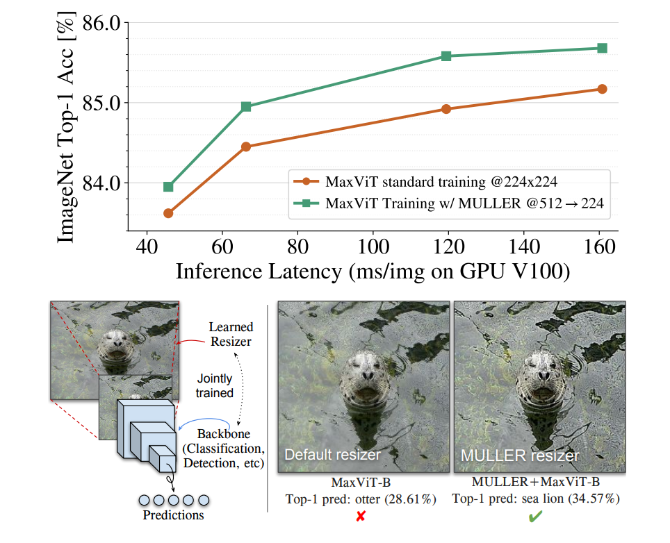

# MULLER: Multilayer Laplacian Resizer for Vision

[](https://arxiv.org/abs/2304.02859)
[](https://colab.research.google.com/github/google-research/google-research/blob/master/muller/muller_demo.ipynb)


This directory contains the model code for the ICCV 2023 paper:
["MULLER: Multilayer Laplacian Resizer for Vision"](https://arxiv.org/abs/2304.02859) \
by [Zhengzhong Tu](https://www.linkedin.com/in/vztu/), [Peyman Milanfar](https://sites.google.com/view/milanfarhome/), and [Hossein Talebi](https://scholar.google.com/citations?hl=en&user=UOX9BigAAAAJ)

*Disclaimer: This is not an official Google product.*




## Pre-requisite

Install dependencies:

```
pip3 install -r requirements.txt
```

## Colab

We have released a Google Colab Demo on the tutorials of how to run MULLER. Try it here [](https://colab.research.google.com/github/google-research/google-research/blob/master/muller/muller_demo.ipynb)

## Citation
Should you find this repository useful, please consider citing:
```
@article{tu2023muller,
  title={MULLER: Multilayer Laplacian Resizer for Vision},
  author={Tu, Zhengzhong and Milanfar, Peyman and Talebi, Hossein},
  journal={ICCV},
  year={2023}
}
```