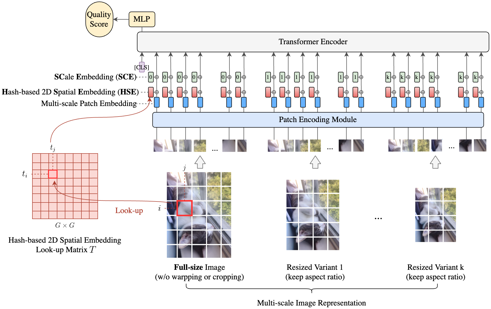

# MUSIQ: Multi-scale Image Quality Transformer

This directory contains checkpoints and model inference code for the ICCV
2021 paper:
["MUSIQ: Multi-scale Image Quality Transformer"](https://arxiv.org/abs/2108.05997)
by Junjie Ke, Qifei Wang, Yilin Wang, Peyman Milanfar, Feng Yang.

*Disclaimer: This is not an official Google product.*




## Pre-requisite

Install dependencies:

```
pip3 install -r requirements.txt
```

The model checkpoints can be downloaded from: *gs://gresearch/musiq/*
[gcloud sdk](https://cloud.google.com/sdk/docs/install)

The folder contains the following checkpoints:

- .../musiq/ava_ckpt.npz: Trained on AVA dataset.
- .../musiq/koniq_ckpt.npz: Trained on KonIQ dataset.
- .../musiq/paq2piq_ckpt.npz: Trained on PaQ2PiQ dataset.
- .../musiq/spaq_ckpt.npz: Trained on SPAQ dataset.
- .../musiq/imagenet_pretrain.npz: Pretrained checkpoint on ImageNet.


## Run Inference


```shell
python3 -m musiq.run_predict_image \
  --ckpt_path=/tmp/spaq_ckpt.npz \
  --image_path=/tmp/image.jpeg
```


## Citation
If you find this code is useful for your publication, please cite the original paper:


```
@inproceedings{jke_musiq_iccv2021,
  title = {MUSIQ: Multi-scale Image Quality Transformer},
  author = {Junjie Ke and Qifei Wang and Yilin Wang and Peyman Milanfar and Feng Yang},
  booktitle = {ICCV},
  year = {2021}
}
```
