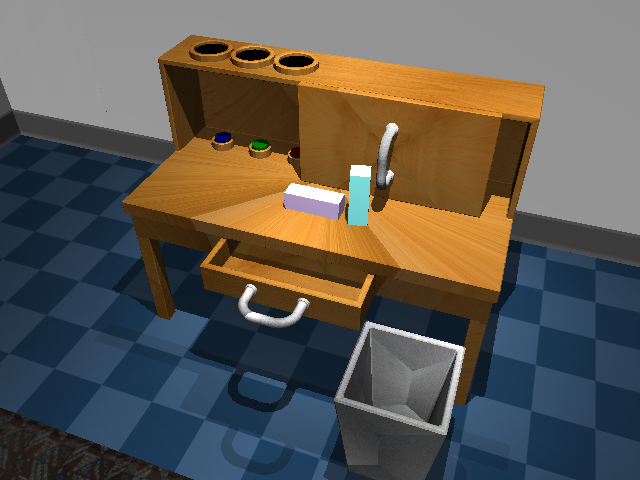
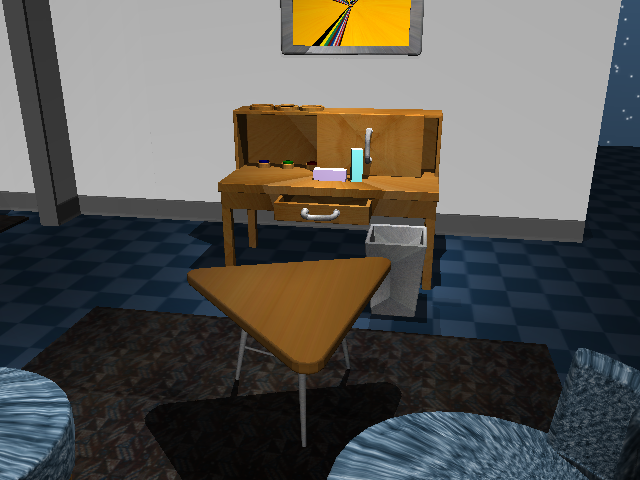

# Playrooms
A suite of simulated rooms that can be used for 'play' training and evaluation.

Example use of Playrooms in the following paper:
https://learning-from-play.github.io/ (1)

## Content
This repository currently includes the original playroom used in (1).
It looks like this (does not contain a robot arm yet, but coming soon):

## Usage
The 3D assets distributed here can be imported in MuJoCo.

## Coming up
- Evaluation code for the 18 tasks defined in (1).
- Play dataset used to train models in (1).
- More playrooms.
- More robots.

## License
This data is licensed by Google Inc. under a [Creative Commons Attribution 4.0 International License](http://creativecommons.org/licenses/by/4.0/).
Texture images are coming from Wikipedia public domain images
under the Wikipedia License (see textures/download.sh for original links to images).

## Contributors
Michael Wu, Vikash Kumar, Corey Lynch, Pierre Sermanet
