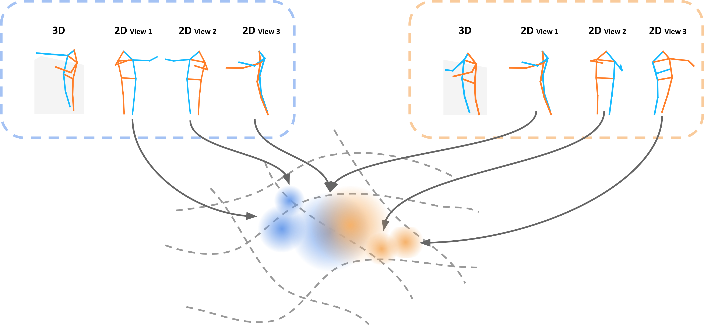

# **`Pr-VIPE`**: **V**iew\-**I**nvariant **Pr**obabilistic **E**mbedding for Human Pose

We propose an approach for learning a compact view-invariant probabilistic
embedding space for 3D human poses from their 2D projections. Please refer to our [paper](https://arxiv.org/abs/1912.01001) and [website](https://sites.google.com/corp/view/pr-vipe/home) for more details.

   

## Contact
- [Ting Liu](https://github.com/tingliu)
- [Jennifer J. Sun](https://github.com/jenjsun)
- [Liangzhe Yuan](https://github.com/yuanliangzhe)

## Updates
- `03/25/2021`: Moved the Pr-VIPE project code into the [`pr_vipe`](https://github.com/google-research/google-research/tree/master/poem/pr_vipe) folder.
- `03/17/2021`: Fixed an [issue](https://github.com/google-research/google-research/issues/636) in camera augmentation.
- `03/04/2021`: Added a program for running model inference.
- `10/21/2020`: Added cross-view pose retrieval evaluation frame keys.
- `10/15/2020`: Added training TFRecords generation program.
- `07/02/2020`: First release. Included core TensorFlow code for model training.
