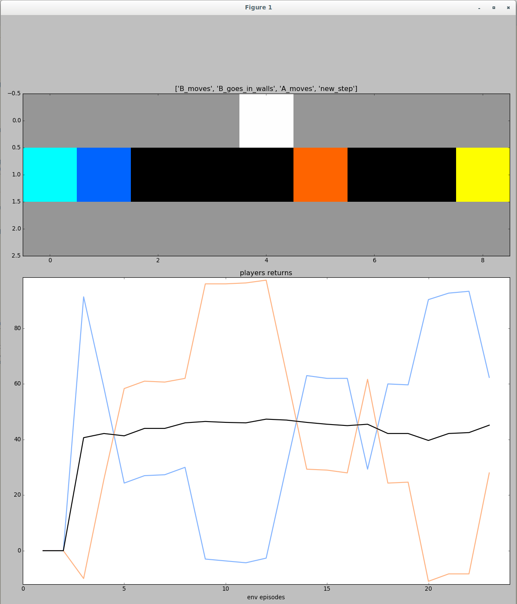

# Psycholab
Psycholab is a tool for easily creating gym-based multi-agent gridworld games.

## Usage
To create a game, you must provide an ascii-art representation, for example:

```python
my_world = ['###########',
            '#      b  #',
            '#         #',
            '#  A   B  #',
            '#         #',
            '# a       #',
            '###########',
            ]
```

This represents a room, surrounded by walls ('#' symbols),
involving two players (capital letters 'A' and 'B')
and two items (lowercase letters 'a' and 'b').
Items can represent rewards or objects to collect. Then, you have to create 
items and players and to provide their colors:

```python
item_a = game.Item(color=(0, 254, 254))
item_b = game.Item(color=(254, 254, 0))

player_a = game.Player(color=(0, 100, 254))
player_b = game.Player(color=(254, 100, 0))
```

By default, the color of an item or a player is white.
Finally, you have to specify which letter represents which player on the ascii-art:

```python
items = {'a': item_a, 'b': item_b, 'd': item_d}
players = {'A': player_a, 'B': player_b}
```

And to generate the resulting game:

```python
game = game.Game(my_world, items, players, tabular=True, max_steps=50)
```

In this initialisation, the parameter `tabular` specifies whether the observations
are discrete states based on players position (`tabular=True`),
or continuous images representing the current game map (`tabular=False`).
The parameter `max_steps` specifies the number of steps after which the game
is reset (by default, `max_steps=100`).

Your game is now similar to a gym-based environement, that can be reset:

```python
initial_observations = game.reset()
```

`initial observations` contains the observation given to each players (by 
default, they share the same observation). A step is performed by providing a
list containing each player's action:

```python
actions = np.random.choice(range(game.num_actions - 1), game.num_players)
observations, rewards, done, infos = game.step(actions)
```

By default, possible action are: 0 (do nothing), 1 (up), 2 (down), 3 (left), 
4 (right). `rewards` is a list containing each player's reward value, `done` 
is a boolean telling if the game is finished and `infos['event_list]` contains a list of
event, such as:
- 'A_moves' (whenever an agent takes a moving action (1,2,3 or 4))
- 'A_goes_to_the_wall'
- 'A_is_blocked_by_X' (when a player is blocked by another player or item)
- 'A_lost_the_drawn' (when several players try to reach the same cell, one player will be picked randomly)

## Visualization
We provide an on-line visualizer, that wraps a game and opens a window 
which is updated when a step is done:

```python
# for frame-by-frame visualization:
env = visualizer.Visualizer(env, fps=2, by_episode=False)
# for fast visualization:
env = visualizer.Visualizer(env, fps=1000, by_episode=True)
```

The window contains the current image of the game map and curves displaying
to the cumulative reward of each player and the average:



## Examples
We provide examples of simple multi-agent gride games that can be created 
via psycholab, as described in *Foolproof Cooperative Learning* 
(https://arxiv.org/abs/1906.09831). Run:

```
# From google-research/
python -m psycholab.example.prisoners_dilemma
```

for the grid prisoners dilemma introduced in *A Polynomial-time Nash 
Equilibrium Algorithm for Repeated Games* (https://arxiv.org/abs/1206.3277).
