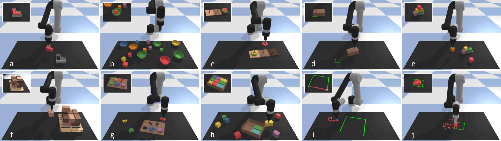

# Ravens - Transporter Networks

Ravens is a collection of simulated tasks in PyBullet for learning vision-based robotic manipulation, with emphasis on pick and place.
It features a Gym-like API with 10 tabletop rearrangement tasks, each with (i) a scripted oracle that provides expert demonstrations (for imitation learning), and (ii) reward functions that provide partial credit (for reinforcement learning).

<br>

(a) **block-insertion**: pick up the L-shaped red block and place it into the L-shaped fixture.<br>
(b) **place-red-in-green**: pick up the red blocks and place them into the green bowls amidst other objects.<br>
(c) **towers-of-hanoi**: sequentially move disks from one tower to another—only smaller disks can be on top of larger ones.<br>
(d) **align-box-corner**: pick up the randomly sized box and align one of its corners to the L-shaped marker on the tabletop.<br>
(e) **stack-block-pyramid**: sequentially stack 6 blocks into a pyramid of 3-2-1 with rainbow colored ordering.<br>
(f) **palletizing-boxes**: pick up homogeneous fixed-sized boxes and stack them in transposed layers on the pallet.<br>
(g) **assembling-kits**: pick up different objects and arrange them on a board marked with corresponding silhouettes.<br>
(h) **packing-boxes**: pick up randomly sized boxes and place them tightly into a container.<br>
(i) **manipulating-rope**: rearrange a deformable rope such that it connects the two endpoints of a 3-sided square.<br>
(j) **sweeping-piles**: push piles of small objects into a target goal zone marked on the tabletop.<br>

Some tasks require generalizing to unseen objects (d,g,h), or multi-step sequencing with closed-loop feedback (c,e,f,h,i,j). 

**Team:** this repository is developed and maintained by [Andy Zeng](https://andyzeng.github.io/), [Pete Florence](http://www.peteflorence.com/), [Daniel Seita](https://people.eecs.berkeley.edu/~seita/), [Jonathan Tompson](https://jonathantompson.github.io/), and (your name here)... This is the reference repository for the paper:

### Transporter Networks: Rearranging the Visual World for Robotic Manipulation
[Project Website](https://transporternets.github.io/)&nbsp;&nbsp;•&nbsp;&nbsp;[PDF](https://arxiv.org/pdf/2010.14406.pdf)&nbsp;&nbsp;•&nbsp;&nbsp;Conference on Robot Learning (CoRL) 2020

*Andy Zeng, Pete Florence, Jonathan Tompson, Stefan Welker, Jonathan Chien, Maria Attarian, Travis Armstrong,<br>Ivan Krasin, Dan Duong, Vikas Sindhwani, Johnny Lee*

**Abstract.** Robotic manipulation can be formulated as inducing a sequence of spatial displacements: where the space being moved can encompass an object, part of an object, or end effector. In this work, we propose the Transporter Network, a simple model architecture that rearranges deep features to infer spatial displacements from visual input—which can parameterize robot actions. It makes no assumptions of objectness (e.g. canonical poses, models, or keypoints), it exploits spatial symmetries, and is orders of magnitude more sample efficient than our benchmarked alternatives in learning vision-based manipulation tasks: from stacking a pyramid of blocks, to assembling kits with unseen objects; from manipulating deformable ropes, to pushing piles of small objects with closed-loop feedback. Our method can represent complex multi-modal policy distributions and generalizes to multi-step sequential tasks, as well as 6DoF pick-and-place. Experiments on 10 simulated tasks show that it learns faster and generalizes better than a variety of end-to-end baselines, including policies that use ground-truth object poses. We validate our methods with hardware in the real world.

## Installation

**Step 1.** Recommended: install [Miniconda](https://docs.conda.io/en/latest/miniconda.html) with Python 3.7.

```shell
curl -O https://repo.anaconda.com/miniconda/Miniconda3-latest-Linux-x86_64.sh
bash Miniconda3-latest-Linux-x86_64.sh -b -u
echo $'\nexport PATH=~/miniconda3/bin:"${PATH}"\n' >> ~/.profile  # Add Conda to PATH.
source ~/.profile
conda init
```

**Step 2.** Create and activate Conda environment, then install GCC and Python packages.

```shell
cd ~/ravens
conda create --name ravens python=3.7 -y
conda activate ravens
sudo apt-get update
sudo apt-get -y install gcc libgl1-mesa-dev
pip install -r requirements.txt
python setup.py install --user
```

**Step 3.** Recommended: install GPU acceleration with NVIDIA [CUDA](https://developer.nvidia.com/cuda-toolkit) 10.1 and [cuDNN](https://developer.nvidia.com/cudnn) 7.6.5 for Tensorflow.
```shell
./install_cuda.sh  #  For Ubuntu 16.04 and 18.04.
conda install cudatoolkit==10.1.243 -y
conda install cudnn==7.6.5 -y
```

**Step 4.** Download object models and assets.
```shell
cd ravens/ravens
wget https://storage.googleapis.com/ravens-assets/assets.zip
unzip assets.zip
```

## Getting Started

**Step 1.** Generate training and testing data. Note: remove `--disp` for headless mode.

```shell
python demos.py --disp --task=block-insertion --mode=train --n=10
python demos.py --disp --task=block-insertion --mode=test --n=100
```

**Step 2.** Train a model e.g., Transporter Networks model.

```shell
python train.py --task=block-insertion --agent=transporter --n_demos=10
```

**Step 3.** Evaluate a Transporter Networks agent with the trained model.

```shell
python test.py --disp --task=block-insertion --agent=transporter --n_demos=10 --n_steps=10000
```

**Step 4.** Plot results.

```shell
python plot.py --disp --task=block-insertion --agent=transporter --n_demos=10
```

**Optional.** Track training and validation losses with Tensorboard.

```shell
python -m tensorboard.main --logdir=logs  # Open the browser to where it tells you to.
```

## Other...

The MDP formulation for each task uses transitions with the following structure:

**Observations:** raw RGB-D images and camera parameters (pose and intrinsics).

**Actions:** a primitive function (to be called by the robot) and parameters.

**Rewards:** total sum of rewards for a successful episode should be =1.

**Info:** 6D poses and colors of objects.

