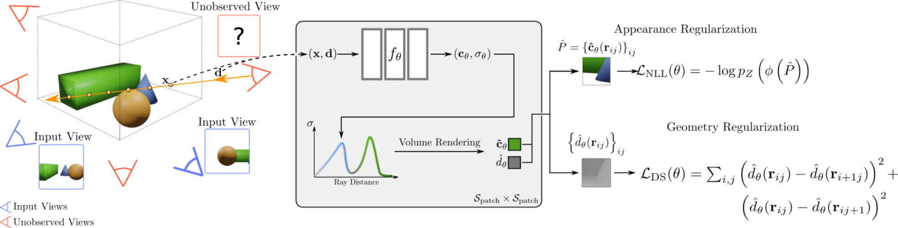

# RegNeRF: Regularizing Neural Radiance Fields for View Synthesis from Sparse Inputs

## [Project Page](https://m-niemeyer.github.io/regnerf/) | [Paper](https://drive.google.com/file/d/1S_NnmhypZjyMfwqcHg-YbWSSYNWdqqlo/view?usp=sharing) | [Video](https://youtu.be/QyyyvA4-Kwc) | [Supplementary](https://drive.google.com/file/d/15ip8Fvfxp6rNRfBnbJEnFCjIJeFMH4CE/view?usp=sharing) | [Arxiv](https://arxiv.org/abs/2112.00724)

This repository contains the code release for the CVPR 2022 project [RegNeRF: Regularizing Neural Radiance Fields for View Synthesis from Sparse Inputs](https://m-niemeyer.github.io/regnerf/). The code is written in [JAX](https://github.com/google/jax), and it is based on Google's [mip-NeRF implementation](https://github.com/google/mipnerf). Contact [Michael Niemeyer](https://m-niemeyer.github.io/) in case you have any questions. 



## Citation

If you find our work useful, please cite it as
```
@InProceedings{Niemeyer2021Regnerf,
    author    = {Michael Niemeyer and Jonathan T. Barron and Ben Mildenhall and Mehdi S. M. Sajjadi and Andreas Geiger and Noha Radwan},  
    title     = {RegNeRF: Regularizing Neural Radiance Fields for View Synthesis from Sparse Inputs},
    booktitle = {Proc. IEEE Conf. on Computer Vision and Pattern Recognition (CVPR)},
    year      = {2022},
}
```

## About RegNeRF

Neural Radiance Fields (NeRF) have emerged as a powerful representation for the
task of novel view synthesis due to their simplicity and state-of-the-art
performance. Though NeRF can produce photorealistic renderings of unseen
viewpoints when many input views are available, its performance drops
significantly when this number is reduced. We observe that the majority of
artifacts in sparse input scenarios are caused by errors in the estimated scene
geometry, and by divergent behavior at the start of training. We address this by
regularizing the geometry and appearance of patches rendered from unobserved
viewpoints, and annealing the ray sampling space during training. We
additionally use a normalizing flow model to regularize the color of unobserved
viewpoints. Our model outperforms not only other methods that optimize over a
single scene, but in many cases also conditional models that are extensively
pre-trained on large multi-view datasets.

**TL;DR:** We regularize unseen views during optimization to enable view synthesis from sparse inputs with as few as 3 input images.

## Installation

We recommend to use [Anaconda](https://www.anaconda.com/products/individual) to set up the environment. First, create a new `regnerf` environment: 

```conda create -n regnerf python=3.6.15```

Next, activate the environment:

```conda activate regnerf```

You can then install the dependencies:

```pip install -r requirements.txt```

Finally, install jaxlib with the appropriate CUDA version (tested with jaxlib 0.1.68 and CUDA 11.0):

```pip install --upgrade jaxlib==0.1.68+cuda110 -f https://storage.googleapis.com/jax-releases/jax_releases.html```

Note: If you run into problems installing jax, please see [the official documentation](https://github.com/google/jax#pip-installation-gpu-cuda) for additional help.

## Data

### DTU Dataset

**Image Data:** Please download the Rectified image and pose data from [the official publication](https://roboimagedata.compute.dtu.dk/?page_id=36).

**Mask Data:** For evaluation, we report also masked metrics (see [Fig. 3 of the main paper](https://drive.google.com/file/d/1S_NnmhypZjyMfwqcHg-YbWSSYNWdqqlo/view) for an in-depth discussion). For this, we use the object masks provided by [DVR](https://github.com/autonomousvision/differentiable_volumetric_rendering) and [IDR](https://github.com/lioryariv/idr) and further create them ourselves for the remaining test scenes. You can download the full mask data here: https://drive.google.com/file/d/1Yt5T3LJ9DZDiHbtd9PDFNHqJAd7wt-_E/view?usp=sharing

### LLFF dataset

**Image Data:** Please use [the official download link](https://drive.google.com/drive/folders/128yBriW1IG_3NJ5Rp7APSTZsJqdJdfc1) from the [NeRF repository](https://github.com/bmild/nerf) for downloading the LLFF dataset.


## Running the code

### Training an new model

*Disclaimer:* The code release does not include the flow model and hence also not the appearance regularization loss. For obtaining results of our full model, please use the provided checkpoints (see below). Running this provided code on a GPU machine, we obtain a mean masked PSNR of 21.37 compared to the previous 21.48 on Scan 114 (Buddha scene) of the DTU dataset. See `other/comparison_masked_psnr.txt` for a per-image comparison. This is in line with [our ablation study in Tab. 3 of the main paper](https://drive.google.com/file/d/1S_NnmhypZjyMfwqcHg-YbWSSYNWdqqlo/view) where we ablate the appearance loss on the entire dataset.

For training a new model from scratch, you need to first need to define your CUDA devices. For example, when having access to 8 GPUs, you can run

```export CUDA_VISIBLE_DEVICES=0,1,2,3,4,5,6,7```

and then you can start the training process by calling

```python train.py --gin_configs configs/{CONFIG} ```

where you replace `{CONFIG}` with the config you want to use. For example, for running an experiment on the LLFF dataset with 3 input views, you would choose the config `llff3.gin`. In the config files, you might need to adjust the `Config.data_dir` argument pointing to your dataset location. For the DTU dataset, you might further need to adjust the `Config.dtu_mask_path` argument. The `*_bl.gin` configs are the mip-NeRF baseline configurations.

Once the training process is started, you can monitor the progress via the tensorboard by calling
```
tensorboard --logdir={LOGDIR}
```
and then opening [localhost:6006](http://localhost:6006/) in your browser. `{LOGDIR}` is the path you indicated in your config file for the `Config.checkpoint_dir` argument. 

### Rendering test images

You can render and evaluate test images by running

```python eval.py --gin_configs configs/{CONFIG} ```

where you replace `{CONFIG}` with the config you want to use. Similarly, you can render a camera trajectory (which we used for our videos) by running

```python render.py --gin_configs configs/{CONFIG} ```


### Using a pre-trained model

You can find our pre-trained models, split into the 6 zip folders for the 6 different experimental setups, here: https://drive.google.com/drive/folders/182-sy2EsAFyN1Oqlyfj9AuC4Ec7jqQ-0?usp=sharing

After downloading the checkpoints, you need to change the `Config.checkpoint_dir` argument in the respective config file accordingly to use the pre-trained model. You can then render test images or camera trajectories as indicated above.

### Downloading model predictions

If you don't want to run the code, you can also directly download the renderings of our models for the test set poses using the following link: https://drive.google.com/drive/folders/15nb1xPO5i3cTLM6nSDCtfjF4tMJUf3vG?usp=sharing