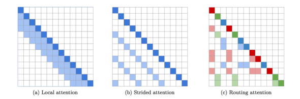

# Efficient content-based sparse attention with Routing Transformers



Code-base accompanying the [paper](https://arxiv.org/abs/2003.05997) (to appear
in [TACL](https://transacl.org/index.php/tacl)).
See also the accompanying
[slides](https://drive.google.com/file/d/1maX-UQbtnVtxQqLmHvWVN6LNYtnBaTd9/view?usp=sharing)
for a quick overview.

## Updates

* Routing Transformer + [REALM](https://github.com/google-research/language/tree/master/language/realm)
  is now [SOTA](https://eval.ai/web/challenges/challenge-page/689/leaderboard/1908#leaderboardrank-1)
  on long form Question Answering (QA) on the
  [ELI5 data-set](https://github.com/facebookresearch/ELI5) on the Knowledge
  Intensive Language Tasks (KILT) [benchmark](https://github.com/facebookresearch/KILT)
  from [Facebook AI](https://ai.facebook.com/blog/introducing-kilt-a-new-unified-benchmark-for-knowledge-intensive-nlp-tasks/),
  with **significant improvements** in generation quality over [BART](https://arxiv.org/abs/1910.13461),
  [RAG](https://ai.facebook.com/blog/retrieval-augmented-generation-streamlining-the-creation-of-intelligent-natural-language-processing-models/),
  [T5](https://arxiv.org/abs/1910.10683)/[Mesh TF](https://arxiv.org/abs/1811.02084)
  , e.g. **+4.11, +5.78, +9.14 Rouge-L improvement** over T5/Mesh TF, BART + DPR
  and RAG respectively.

## Pre-trained Checkpoint

Model     | Hparams  | Context Length | Data-set | Vocab                                                                                     | Download
--------- |  ---------------------- | -------------- | ----------------------------------------- | ----------------------------------------------------------------------------------------- | --------
`RT-base` | `pg19_local_cluster8k` | 8192           | [PG-19](https://github.com/deepmind/pg19) | [vocab98K](https://storage.googleapis.com/rt-checkpoint/vocab.pg19_length8k.32768.subwords) | [checkpoint.zip](https://storage.googleapis.com/rt-checkpoint/checkpoint.zip)

## Explanation of hyperparameters

### Local Attention

*   `local_num_heads`: Number of local attention heads
*   `query_shape`: This represents the shape of the query block.
    *   For 1-d local attention with block size `b`, this would be `(b,)`
*   `memory_query_shape`: This represents the query shape of memory antecedent
    and is useful for encoder-decoder attention
    * This is usually set the same as `query_shape` by default
    * This is useful when inputs and targets are of different lengths
    * E.g., if inputs are of length `4096` and targets of length `8192`
    * Plausible setting:`query_shape = (256,)`, `memory_flange = (256,)` and
      `memory_query_shape = (128,)`
    * This is because with block size `256`, the targets will have `32` blocks
    * To match this in enc-dec attention, the inputs must have `32` blocks
    * This is why we set `memory_query_shape = (4096/32,) = (128,)`
*   `memory_flange`: This represents the overlap of the memory block
    * Example setting: `query_shape = (b,)` and `memory_flange = (m * b, )`
    * Masked: Each query block attends to `m` previous blocks
    * Unmasked: Each query block attends to `m` previous & `m` subsequent blocks
    * Setting this to `(0,)` means all the blocks are independent of each other
    * Setting to `(0,)` is used for full attention, or for axial attention
    * This must be a multiple of `query_shape` in every dimension
*   Example setting can be found in `sparse_transformer.py` under `pg19_local8k`

### Routing Attention

*   `sparsity_cluster_num_heads`: Number of routing attention heads
*   `sparsity_cluster_size`: Number of clusters
*   `sparsity_cluster_attention_window`: Average size of each cluster
*   `sparsity_skip_first`: Number of initial layers to skip routing attention
    *   `sparsity_skip_first = 0` would have routing attention in every layer
    *   `sparsity_skip_first` equalling total layers would have no routing
        attention
*   Example setting can be found in `sparse_transformer.py` under
    `pg19_local_cluster8k`

## Samples

### PG-19 (sequence length 8k):

- [sample1](https://docs.google.com/document/d/1YE6644MprOr1vJkY0lJPeYswJQxncBmD_O12LQAMxIA/edit?usp=sharing)
- [sample2](https://docs.google.com/document/d/1UwCYAbIMHOXe07X5ELMwTPa90rqrZCGiJML4jywc0yY/edit?usp=sharing)
- [sample3](https://docs.google.com/document/d/1dC2zNExumaaxTu7BiClo88bZ0JKJMAJolJQDkcOHT70/edit?usp=sharing)
- [sample4](https://docs.google.com/document/d/1zoYG-x_1ElNZc6TatHfGgasNKAuOEqtaBI91ygfb2jA/edit?usp=sharing)
- [sample5](https://docs.google.com/document/d/1XvwY8jFUGGEw3S2HzNx7gBg-9nzSRWHtQVNQAyTVuAU/edit?usp=sharing)
- [sample6](https://docs.google.com/document/d/1RZrOI8e7n7czgA_a7Mt34ePymUFwyjEYrjohZ8aoBoc/edit?usp=sharing)
- [sample7](https://docs.google.com/document/d/1WfSqLCAEd8W3_s3dpaLPH3JwCG3ucBiK_JsoG8q0K3U/edit?usp=sharing)
- [sample8](https://docs.google.com/document/d/1O6KdRk5E-JWnhFmcFjiJwAEMHnprtN1ADr3JUvu65EM/edit?usp=sharing)
- [sample9](https://docs.google.com/document/d/1ZoM2-NCC7wTaB0bsuJw5W6HFslrRmczK8lJaoKsfaps/edit?usp=sharing)
- [sample10](https://docs.google.com/document/d/1x47B8hSRYCcOCHSLCLGctsZTWeeBFYhbbpRftAsh-Bw/edit?usp=sharing)

### Document Machine Translation (sequence length 4k):

-   [sample](https://docs.google.com/document/d/1wqKAyHx7IzJIS0nH9zFYM6KxkjR1qlnYjaECUI9YmmY/edit?usp=sharing)

## Acknowledgments
The authors would like to thank Phillip Wang and
Aran Komatsuzaki for a [Pytorch implementation](https://github.com/lucidrains/routing-transformer)
of Routing Transformer. The authors would also like
to thank Yonghui Wu, Weikang Zhou and Dehao
Chen for helpful feedback in improving the implementation of this work.
The authors would also
like to thank anonymous reviewers and the Action
Editor Xavier Carreras of TACL for their constructive comments
which helped improve the exposition of this work.

## How to Cite

If you extend or use this work, please cite the
[paper](https://arxiv.org/abs/2003.05997) where it was introduced:

```
@article{roy2020efficient,
  title={Efficient content-based sparse attention with routing transformers},
  author={Roy, Aurko and Saffar, Mohammad and Vaswani, Ashish and Grangier, David},
  journal={arXiv preprint arXiv:2003.05997},
  year={2020}
}
```
