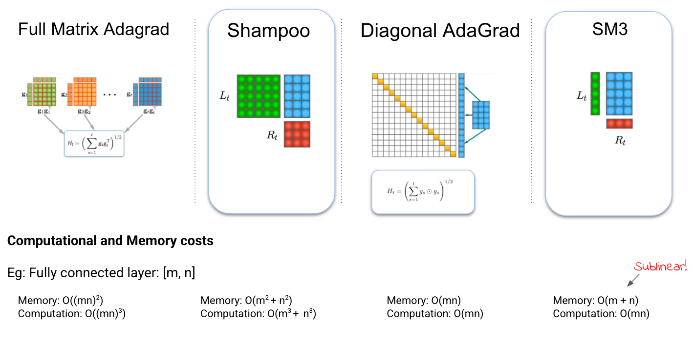

# Distributed Shampoo Implementation

<p align="center"> Rohan Anil and Vineet Gupta {rohananil, vineet} at google dot com. </p>



Optimization in machine learning, both theoretical and applied, is presently
dominated by first-order gradient methods such as stochastic gradient descent.
Second-order optimization methods, that involve second derivatives and/or
second order statistics of the data, are far less prevalent despite strong
theoretical properties, due to their prohibitive computation, memory and
communication costs.

Here we present a scalable implementation of a second-order preconditioned
method (concretely, a variant of full-matrix Adagrad) that provides significant
convergence and wall-clock time improvements compared to conventional
first-order methods on state-of-the-art deep models.


Paper preprints:
https://arxiv.org/abs/2002.09018
https://openreview.net/forum?id=Sc8cY4Jpi3s (To be updated).

```
@article{anil2020second,
  title={Second order optimization made practical},
  author={Anil, Rohan and Gupta, Vineet and Koren, Tomer and Regan, Kevin and Singer, Yoram},
  journal={arXiv preprint arXiv:2002.09018},
  year={2020}
}
```

## The MLPerf ResNet-50 Training benchmark results

The MLPerf training benchmark for ResNet-50 v1.5 on ImageNet [5] aims to reach
75.9% validation accuracy in the shortest possible wall-clock time. MLPerf is a
trademark of MLCommons.org, more information here: https://mlperf.org/training-overview .
The competition had found the LARS optimizer [6], a first order method to work really well for training time improvement at very large batch sizes.

Very recently, Nado and Gilmer et al 2021 [4] did a comprehensive evaluation of several first order
methods on this task and provided strong baselines results for SGD with Nesterov
momentum matching previous best LARS of 2512 steps to 75.9% validation accuracy
at batch sizes of 32,768.

This work releases distributed Shampoo implementation in JAX [7] that improves
over the current state of the art by reaching **75.9% validation accuracy** in
**1729 steps**. It also achieves faster overall wall-clock time of **284 seconds**
with the same benchmarking hardware CloudTPU-v3-256 (256 cores).

|      Optimizer      | Steps to reach 75.9 validation accuracy | Wall clock time |
|:-------------------:|-----------------------------------------|-----------------|
|         LARS        |                   2512                  | ~309-311 seconds    |
|       Nesterov      |                   2512                  | ~309-311 seconds    |
| **Distributed Shampoo (this work)** |         **1729 (31.17 % reduction)**        | **~269-272 seconds**  |

## Why is this even interesting?

*   Here we are demonstrating improvements both in steps to result, as well as wall-clock with a second-order method on a highly tuned baseline i.e practioners believe SGD-M variants are very strong baselines for ResNets with BatchNorm.
*   We speculatively maybe able to further extend the linear scaling regime to
    even larger batches, which we will do shortly.
*   At larger batch sizes the overhead of computing inverse pth root will
    reduce further for fixed hardware allowing us to realize most of the gains
    from improved steps to convergence!
*   Presenting evidence that Shampoo works on both ResNet like models as well as Transformers.
*   A working implementation of the procedure -- we noticed several
    reimplementations on GitHub that had issues with numerics or how algorithm
    is implemented, making them unlikely to work.

## How?

We were focussing on much larger scale benchmarks before this. We knew Shampoo
was useful but demonstrating it required many things to come together. Moreover,
the engineering effort alone was large to get it working well on
smaller benchmarks such as ResNet-50. We recently started exploring
reimplementing the method in several frameworks, which made us revisit some
earlier decisions. We finally list the details that helped with improving
both wall-clock time as well steps to results.

1.  We split large tensors into smaller tensors with atmost dimension 128
    (allowing faster inverse pth root), described in:
    https://openreview.net/forum?id=Sc8cY4Jpi3s - This reduces the computational
    complexity significantly.
2.  We use f32 (instead of f64) for ResNets, and search for matrix epsilon
    between \[1e-6, 1e-1\]. Normalizing the statistics to have maximal eigen
    value of 1.0, and adding epsilon (1e-6) identity to the statistic
    matrix bounds the condition number to be atmost 10^6. This is roughly at the
    limit of condition number that can be correctly inverted with f32 precision.
3.  We run the inverse pth root computation every step. Moreover, computation
    is distributed across all TPU cores -- This is by mixing in optimizer level
    parallelism with-in data parallel mode of training.
4.  We added several stability fixes to matrix pth root as its finicky to
    get right, and crucial.
5.  We let the exponent be a tunable parameter. Default choice in the algorithm
    is 1/(2 x rank). Overriding this exponent can mean that the approximation
    is for either, full matrix AdaGrad, Online Newton Step or something else.
6.  We implement Grafting to SGD to fix the per layer scale of Shampoo update
    and combine it with Nesterov Momentum. We find in practice the implict
    schedule from Shampoo update to not work well.
7.  We further group smaller dimensions together for eg: \[3, 3, 128, 128\] will
    be reshaped into \[9, 128, 128\] before computing the Shampooo
    preconditioners allowing us to improve the resolution of the second moments
    that are computed.
8.  Hard work done by JAX, TensorFlow, XLA and TPU teams
    in making infrastructure improvements ontop of which all of this is written that we
    take for granted.
9.  Nado and Gilmer et al 2021 [4] demonstrated that tuning is crucial, and also
    how to tune effectively -- Hence, we follow in their foot steps, and tune distributed
    Shampoo similarly.

## To reproduce

Firstly, we are following the procedure from Nado and Gilmer et al 2021 [4] to measure success.
Specifically, we measure the median validation accuracy over 50 training
seeds with a fixed budget of 1,729 training steps at a batch size of 32,768. Code used for training is in [8].

Hyperparameters for variables except bias and batch normalization variables.

```
_ShampooHyperParams(
  learning_rate=13.0, beta1=0.95, beta2=0.85,
  diagonal_eps=0.0, matrix_eps=1.5e-05, weight_decay=0.0001,
  start_preconditioning_step=25, preconditioning_compute_steps=1, statistics_compute_steps=1,
  no_preconditioning_for_layers_with_dim_gt=8192,
  block_size=128,
  best_effort_shape_interpretation=True
  , graft_type=<LayerwiseGrafting.SGD: 1>,
  nesterov=True, exponent_override=4.0,
  batch_axis_name='batch')
```

Weight decay is not applied to bias and batch normalization variables, other
hyperparameters are identical. Effect of this difference was minor -- but we loved the 1729 step number [9] and did not want to extend it further (likely by less than a hundred steps).

Learning rate schedule:

1. 196 step linear warmup
2. 1533 steps of quadratic decay
3. 1729 total steps to train

```
def polynomial_learning_rate_fn(base_lr, warmup_steps, train_steps):
  decay_steps = train_steps - warmup_steps + 1
  end_lr = 0.0
  def step_fn(step):
    warmup_lr = base_lr * (step / warmup_steps)
    decay_step = jnp.minimum(step - warmup_steps, decay_steps)
    decay_multiplier = 1 - decay_step / decay_steps
    poly_lr = end_lr + (base_lr - end_lr) * (decay_multiplier ** 2)
    return jnp.where(step <= warmup_steps, warmup_lr, poly_lr)
  return step_fn
```

## How to use?

```
    optimizer_def = shampoo.Shampoo(
        learning_rate=learning_rate,
        beta1=0.9,
        beta2=0.99,
        diagonal_epsilon=0.0,
        matrix_epsilon=1e-5,
        exponent_override=4,
        weight_decay=1e-4,
        start_preconditioning_step=25,
        preconditioning_compute_steps=1,
        statistics_compute_steps=1,
        no_preconditioning_for_layers_with_dim_gt=8192,
        best_effort_shape_interpretation=True,
        block_size=128,
        graft_type=shampoo.LayerwiseGrafting.SGD,
        nesterov=True,
        # Axis name for your pmap.
        batch_axis_name='batch')

```


## References

[1] "Shampoo: Preconditioned Stochastic Tensor Optimization",
  Vineet Gupta, Tomer Koren, Yoram Singer, https://arxiv.org/abs/1802.09568

[2] "Memory-Efficient Adaptive Optimization", Rohan Anil, Vineet Gupta,
  Tomer Koren, Yoram Singer, https://arxiv.org/abs/1901.11150
  Code: https://github.com/google-research/google-research/tree/master/sm3

[3] "Disentangling Adaptive Gradient Methods from Learning Rates",
  Naman Agarwal, Rohan Anil, Elad Hazan, Tomer Koren, Cyril Zhang,
  https://arxiv.org/abs/2002.11803

[4] "A Large Batch Optimizer Reality Check: Traditional, Generic Optimizers
  Suffice Across Batch Sizes", Zachary Nado, Justin M. Gilmer, Christopher J.
  Shallue, Rohan Anil, George E. Dahl, https://arxiv.org/abs/2102.06356

[5] "MLPerf: An industry standard benchmark suite for machine learning
  performance." Mattson, Peter, Vijay Janapa Reddi, Christine Cheng,
  Cody Coleman, Greg Diamos, David Kanter, Paulius Micikevicius et al.
  https://arxiv.org/pdf/1910.01500.pdf

[6] "Large batch training of convolutional networks." You, Yang, Igor Gitman,
  and Boris Ginsburg. https://arxiv.org/abs/1708.03888

[7] "JAX: composable transformations of Python+NumPy programs." James Bradbury
  and Roy Frostig and Peter Hawkins and Matthew James Johnson and Chris Leary
  and Dougal Maclaurin and George Necula and Adam Paszke and Jake VanderPlas
  and Skye Wanderman-Milne and Qiao Zhang http://github.com/google/jax

[8] "Jax implementation of ResNet-50 Model for MlPerf v0.7"
  [Link to code](https://github.com/mlperf/training_results_v0.7/blob/master/Google/benchmarks/resnet/implementations/resnet-research-JAX-tpu-v3-8192/train.py)

[9] "Ramanujam number", [https://en.wikipedia.org/wiki/1729](https://en.wikipedia.org/wiki/1729_(number))
