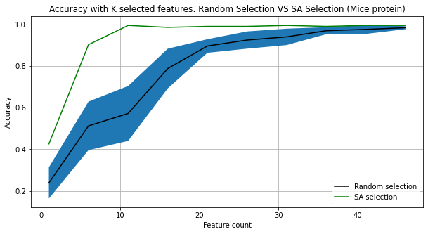
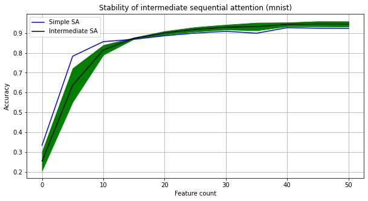
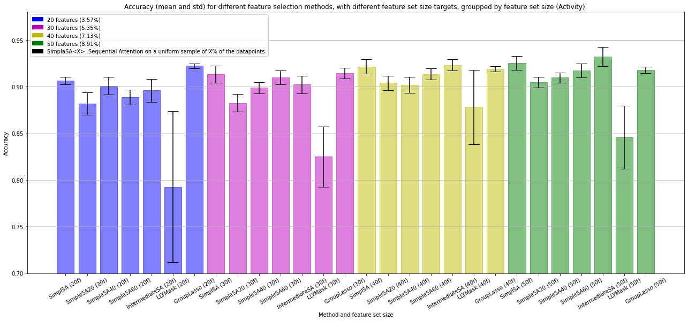

# Ensembled Sequential Attention

This directory hosts a Python 3 notebook that extends the work in 
[Yasuda et al. 2023](https://arxiv.org/abs/2209.14881). We run a comparative
study using both low data regimes and low features regimes, with both Simple
Sequential Attention and Intermediate (Ensembled) Sequential Attention to 
understand how we can both lower the data quantity as well as produce better
and more consistent results.

Below are some of the most important results of this work, highlighting that:

1. First image: the number of features can still be dropped on certains datasets while keeping the same quality
2. Second image: intermediate sequential attention is more stable than simple sequential attention
3. Third image: For the same setup of the paper (50 features, Activity dataset), Intermediate Sequential Attention is 0.7% better than the SOTA. Test set accuracies are:
  - 92.54% with Simple SA on 50 features
  - **93.22%** with Intermediate SA on 50 features
  - 94.47% with a model trained on the full dataset (561 features)

Point of contact for this work: Mihai Anton
