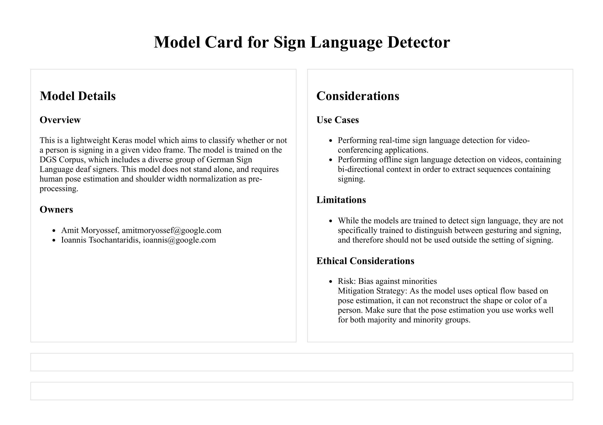

# Sign Language Detection

This is a TensorFlow implementation of the model proposed in
[Real-Time Sign Language Detection using Human Pose Estimation](https://arxiv.org/abs/2008.04637),
published in SLRTP 2020.

This model is used in the
[Real-TIme Sign Language Detection for Videoconferencing](https://youtu.be/nozz2pvbG_Q)
demo published in ECCV 2020.

## Models

This repository includes pre-trained models for both python ([py](models/py/))
and javascript ([js](models/js/)) .



## Usage

You can use the included models to perform inference or fine-tuning.

To load a model in python, use
`tensorflow.python.keras.models.load_model('models/py/model.h5')`.

To load a model in the browser, use `tf.loadLayersModel('models/js/model.json')`
from [tfjs](https://github.com/tensorflow/tfjs).

You can use the [train.py](train.py) script to train the model from scratch
using a `tfrecord` dataset file.

```bash
python -m train --dataset_path="data.tfrecord" --device="/GPU:0"
```

## Dataset

The provided models were trained on the
[Public DGS Corpus](https://www.sign-lang.uni-hamburg.de/meinedgs/ling/start-name_en.html).

The dataset is represented as a `tfrecord` file where each video has 4
properties: 1. `fps`:`Int64List` - the framerate of the video 1.
`pose_data`:`BytesList` - human pose estimation, as a tensor of the shape
`(frames, 1, points, dimensions)` 1. `pose_confidence`:`BytesList` - human pose
estimation confidence, as a tensor of the shape `(frames, 1, points)` 1.
`is_signing`:`BytesList` - a bytes object representing weather the user was
signing or not in every frame.

Please see `examples/create_tfrecord.py` for an example of creating this record.

In this work, we use a 50:25:25 data split. The official split used in the
trained models can be found in the [split](split/) directory.

### Citations

```
@inproceedings{moryossef2020sign,
  title={Real-Time Sign Language Detection using Human Pose Estimation},
  author={Amit Moryossef and Ioannis Tsochantaridis and Roee Aharoni and Sarah Ebling and S. Narayanan},
  journal={SLRTP},
  year={2020},
}


# If you are using the Public DGS Corpus
@inproceedings{hanke2020extending,
  title={{E}xtending the {P}ublic {DGS} {C}orpus in Size and Depth},
  author={Hanke, Thomas and Schulder, Marc and Konrad, Reiner and Jahn, Elena},
  booktitle={Proceedings of the LREC2020 9th Workshop on the Representation and Processing of Sign Languages: Sign Language Resources in the Service of the Language Community, Technological Challenges and Application Perspectives},
  pages={75--82},
  year={2020}
}
```
