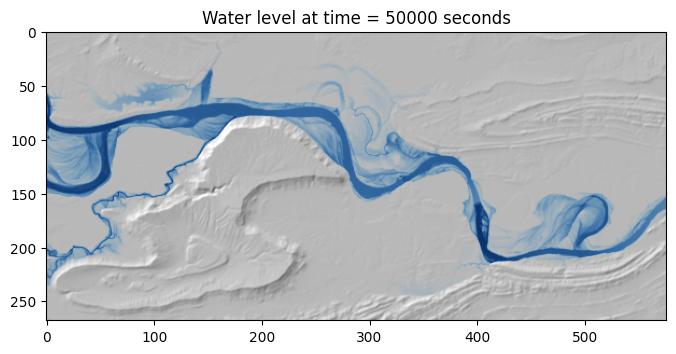

# Physics-Based Flood Simulation.

This is a physics-based flood simulation that runs on Tensor Processing
Unit (TPUs) as a Jupyter Notebook, accessing Google Cloud TPUs through
[Google Colaboratory](https://colab.research.google.com/).

The code takes as input a digital elevation map (DEM), which is a 2D array of
heights. Another input is the water inflow rate. An example output of running
the example scenario included in the notebok is shown below. The image plots the
simulated flood overlaid on the DEM.

To use, open the Jupyter Notebook file in
[Google Colaboratory](https://colab.research.google.com/) and follow the text
instructions in the notebook file.

