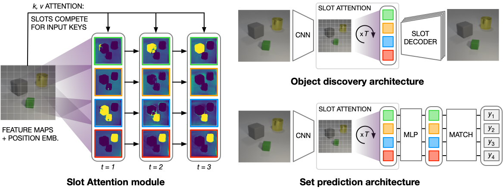

# Slot Attention

This is a reference implementation for "Object-Centric Learning with Slot
Attention"
[(https://arxiv.org/abs/2006.15055)](https://arxiv.org/abs/2006.15055) by
Francesco Locatello, Dirk Weissenborn, Thomas Unterthiner, Aravindh Mahendran,
Georg Heigold, Jakob Uszkoreit, Alexey Dosovitskiy, and Thomas Kipf.



When using this code, please cite the paper:

```
@article{locatello2020object,
    title={Object-Centric Learning with Slot Attention},
    author={Locatello, Francesco and Weissenborn, Dirk and Unterthiner, Thomas and Mahendran, Aravindh and Heigold, Georg and Uszkoreit, Jakob and Dosovitskiy, Alexey and Kipf, Thomas},
    journal={arXiv preprint arXiv:2006.15055},
    year={2020}
}
```

## Requirements

Make sure to have a GPU-compatible version of TensorFlow (`>= 2.2.0`) installed
and install TensorFlow Datasets (`pip install tensorflow-datasets`) to load the
["CLEVR dataset"](https://cs.stanford.edu/people/jcjohns/clevr/). Lastly, make
sure you have the `absl-py` package installed: `pip install absl-py`.
Alternatively you can run `pip3 install -r requirements.txt` (see `run.sh`).

The code was tested on a single GPU with 16GB of memory. Consider reducing the
batch size to train the model on GPUs with less memory.

NOTE: Executing the code (training or evaluation) for the first time will
download the full CLEVR dataset (17.7GB).

## Set Prediction

To train the set prediction model, navigate to the `google_research` directory
and run:

```
python -m slot_attention.set_prediction.train
```

Model checkpoints will be saved in `/tmp/set_prediction/` (unless otherwise
specified). For evaluation of a trained model, run:

```
python -m slot_attention.set_prediction.eval
```

## Object Discovery

To train the object discovery model, navigate to the `google_research` directory
and run:

```
python -m slot_attention.object_discovery.train
```

Model checkpoints will be saved in `/tmp/object_discovery/` (unless otherwise
specified). For evaluation of a trained model, open
`object_discovery/eval.ipynb` in Jupyter Lab (or Jupyter Notebook). This
notebook contains code to load a model from a checkpoint and to visualize slot
reconstructions on the CLEVR dataset.

NOTE: Different from the paper, we train and evaluate the model on the original
CLEVR dataset (not the version from
[https://github.com/deepmind/multi_object_datasets](https://github.com/deepmind/multi_object_datasets))
for simplicity. The original CLEVR dataset does not include mask annotations and
hence we do not compute segmentation metrics (ARI score). Note also that the
dataset statistics are different between the two datasets (position/size of
objects, number of objects per image, etc.). Therefore, results are not directly
comparable.

## Disclaimer

This is not an official Google product.
