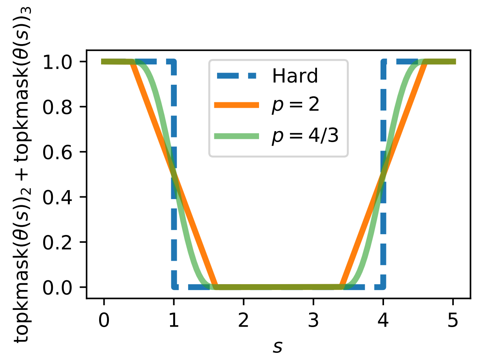

Sparse soft top-k
=================

An implementation of the following paper:

  Fast, Differentiable and Sparse Top-k: a Convex Analysis Perspective.
  Michael E. Sander, Joan Puigcerver, Josip Djolonga, Gabriel Peyré, Mathieu Blondel.
  [arXiv:2302.01425](https://arxiv.org/abs/2302.01425)

<p align="center">

</p>
Figure: Illustration of our differentiable and sparse top-k mask. For $$k=2$$, we consider $$x(s) = (3, 1, -1 + s, s) $$ and plot $$\mathrm{topkmask}(x(s))_2 + \mathrm{topkmask}(x(s))_3$$ as a function of $$s$$. We compare the hard version (no regularization) with our proposed operator using $$p$$-norm regularization: $$p=2$$ leads to differentiable operator with kinks; $$p=4/3$$, leads to a smooth operator. Both operators are sparse: they are exactly 0 for some values of $$s$$.


Dependencies
------------

* JAX
* Numba

Overview
--------

We propose two fast implementations of sparse yet differentiable ("soft") top-k
operators. 

- The top-k mask operator returns a bit-vector encoding whether each value is
 within the top-k values or not:

$$
\mathrm{topkmask}(x)_i =
1, \text{if }  x_{i} \text{ is in the k biggest values of } x \text{ and } 0 \text{ otherwise}. 
$$

- The top-k operator in magnitude returns the values themselves if they are within the top-k 
absolute values or 0 otherwise:

$$
\mathrm{topkmag}(x) = x \circ \mathrm{topkmask}(|x|).
$$

Our relaxed operators are obtained leveraging p-norm regularizations, that trade sparsity for smoothness.
We provide two implementations of these smooth operators:

  - One implementation is based on the Pool Adjacent Violators (PAV) algorithm. PAV returns an exact solution and supports arbitrary regularization (with linear complexity in the case $$p=2$$ or $$p=4/3$$). It relies on a numba implementation.

  - One implementation is based on Dykstra's projection algorithm. It returns an approximate solution. Dykstra's projection algorithm can be faster than PAV on GPU/TPU, and is implemented in pure JAX.

Example
-------

```python
>>> import sparse_soft_topk
# Define input values
>>> values = jnp.array([-5., -2., 3., 1.])
# First, we can return the top-2 mask of the vector values
>>> print("soft top-k mask with PAV: ",sparse_soft_topk.sparse_soft_topk_mask_pav(values, k=2, l=1e-2))
soft top-k mask with PAV:  [0.         0.         0.99999714 0.99999714]
```

Note that our output is sparse as it is exactly 0 outside the top-2 values.

```python
# Similarly, we can also consider the top-2 in magnitude
>>> print("soft top-k in magnitude with PAV: ", sparse_soft_topk.sparse_soft_topk_mag_pav(values, k=2, l=1e-2))
soft top-k in magnitude with PAV:  [-5.000036  -0.         2.9999416  0.       ]
```

Alternatively, one can use Dykstra's projection algorithm to compute 
an approximation of the same operators:

```python
>>> print("soft top-k mask with Dykstra: ", sparse_soft_topk.sparse_soft_topk_mask_dykstra(values, k=2, l=1e-2))
soft top-k mask with Dykstra:  [0.         0.         0.99999905 0.99999905]
```

```python
>>> print("soft top-k in magnitude with Dykstra: ", sparse_soft_topk.sparse_soft_topk_mag_dykstra(values, k=2, l=1e-2))
soft top-k in magnitude with Dykstra:  [-4.9999804 -0.         2.999993   0.       ]
```

One can compare the output with the hard counterpart operators

```python
>>> print("hard top-k mask: ", sparse_soft_topk.hard_topk_mask(values, k=2))
hard top-k mask:  [0. 0. 1. 1.]
```

```python
>>> print("hard top-k in magnitude: ", sparse_soft_topk.hard_topk_mag(values, k=2))
hard top-k in magnitude:  [-5. -0.  3.  0.]
```


Batched data
------------

Our implementation using PAV algorithm is based on a pure_callback with numba just in time compilation. It supports arbitrary shaped inputs without vmaping. The top-k is applied along the last dimension.

```python
>>> values = (5 * jax.random.normal(jax.random.PRNGKey(2), (2, 3, 4))).astype(jnp.int32)
>>> print("values: \n", values)
values: 
 [[[-11   1   4  -7]
  [  5   1   4   1]
  [-10  -3   4  -6]]

 [[  7  -6  -8  -4]
  [ -1   9   8   4]
  [  0   0  -5   5]]]
```

```python
>>> print("soft top-k mask with PAV: \n", sparse_soft_topk.sparse_soft_topk_mask_pav(values, k=2, l=1e-2))
soft top-k mask with PAV: 
 [[[0.         0.99999714 0.99999714 0.        ]
  [1.0000687  0.         0.99999714 0.        ]
  [0.         0.99999714 0.99999714 0.        ]]

 [[1.0000687  0.         0.         1.0000687 ]
  [0.         1.0000687  1.0000687  0.        ]
  [0.49999988 0.49999988 0.         1.0000687 ]]]
```


```python
>>> print("soft top-k in magnitude with PAV: \n", sparse_soft_topk.sparse_soft_topk_mag_pav(values, k=2, l=1e-2))
soft top-k in magnitude with PAV: 
 [[[-10.999428    0.          0.         -7.0002456]
  [  5.000036    0.          3.9999368   0.       ]
  [-10.000449   -0.          0.         -5.999853 ]]

 [[  7.0002456  -0.         -7.99995    -0.       ]
  [ -0.          8.999435    7.99995     0.       ]
  [  0.          0.         -5.000036    5.000036 ]]]
```
Our Dykstra implementation is in pure JAX, and one can simply use vmap.

```python
>>> soft_topk_mask_fn = functools.partial(
        sparse_soft_topk.sparse_soft_topk_mask_dykstra,
        k=2, num_iter=100, l=1e-2)
>>> print("soft top-k mask with Dykstra: \n", jax.vmap(jax.vmap(soft_topk_mask_fn), in_axes=1, out_axes=1)(values))
soft top-k mask with Dykstra: 
 [[[0.         0.99999905 0.99999905 0.        ]
  [1.0000229  0.         0.99999905 0.        ]
  [0.         0.99999905 0.99999905 0.        ]]

 [[1.0000229  0.         0.         1.0000229 ]
  [0.         1.0000229  1.0000229  0.        ]
  [0.5        0.5        0.         1.0000229 ]]]
```

```python
>>> soft_topk_mag_fn = functools.partial(
        sparse_soft_topk.sparse_soft_topk_mag_dykstra,
        k=2, num_iter=100, l=1e-2)
>>> print("soft top-k in magnitude with Dykstra: \n", jax.vmap(jax.vmap(soft_topk_mag_fn), in_axes=1, out_axes=1)(values))
soft top-k in magnitude with Dykstra: 
 [[[-10.999967    0.          0.         -6.999992 ]
  [  4.9999804   0.          3.9999988   0.       ]
  [ -9.999961   -0.          0.         -5.999986 ]]

 [[  6.999992   -0.         -7.9999976  -0.       ]
  [ -0.          8.999955    7.9999976   0.       ]
  [  0.          0.         -4.9999804   4.9999804]]]
```

Differentiability
-----------------

Our operators are differentiable. By default, the top-k with PAV algorithm uses a p-norm regularization with p=4/3, which leads to a continuously differentiable operator. Dykstra's projection algorithm works for p=2, and leads to an almost differentiable everywhere operator.

```python
>>> k = 4
>>> l = .5

# We define two scalar functions: one with our sparse operator, and the second with their hard counterparts.

>>> @jax.jit
>>> def sparse_soft_f(x):
>>>   out = sparse_soft_topk.sparse_soft_topk_mask_pav(x, k=k, l=l) + sparse_soft_topk.sparse_soft_topk_mask_pav(x**2, k=k, l=l)
>>>   return (out ** 2).mean()

>>> @jax.jit
>>> def hard_f(x):
>>>   out = sparse_soft_topk.hard_topk_mask(x, k=k) + sparse_soft_topk.hard_topk_mask(x**2, k=k)
>>>   return (out ** 2).mean()

>>> x = jax.random.normal(jax.random.PRNGKey(2), (10,)) 
```

The hard function has 0 derivatives everywhere:

```python
>>> print(jax.grad(hard_f)(x))
[0. 0. 0. 0. 0. 0. 0. 0. 0. 0.]
```

whereas our soft operator has non-zero derivatives:

```python
>>> print(jax.grad(sparse_soft_f)(x))
[ 0.          0.09063217  0.2323066   0.          0.12527105  0.05957882
 -0.13923873  0.05559958  0.         -0.09306791]
```

Cite
----

If you use this code in your project, please cite:

    Michael E. Sander, Joan Puigcerver, Josip Djolonga, Gabriel Peyré, Mathieu Blondel
    Fast, Differentiable and Sparse Top-k: a Convex Analysis Perspective
    In International Conference on Machine Learning (pp. 29919-29936). PMLR.
    https://arxiv.org/abs/2302.01425

  