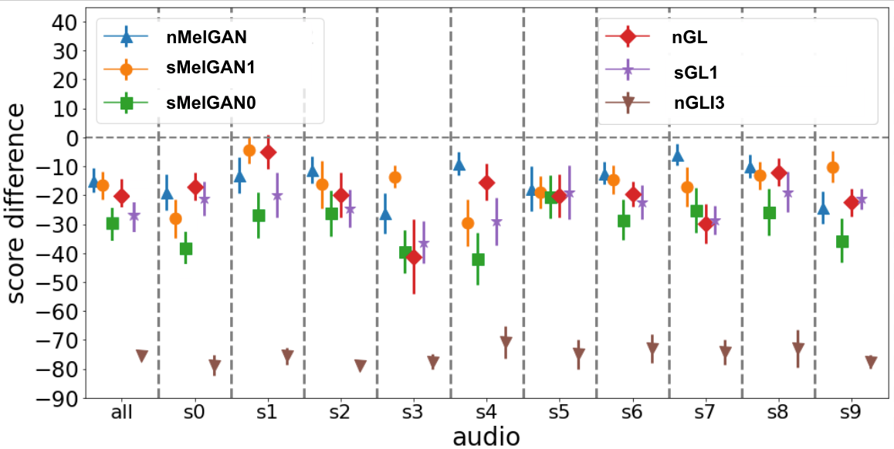

Input/output audio data discussed in paper [Real time spectrogram inversion on mobile phone](https://arxiv.org/abs/2203.00756).

# [Main demo link](https://google.github.io/tacotron/publications/specinvert/index.html) with input and output audio used for experiments of this paper.

# Demo colab with TFLite model inference.

In the demo [colab](https://github.com/google-research/google-research/blob/master/specinvert/vctk/demo/demo.ipynb) we have end to end TFLite vocoder model inference, which reads input audio, converts it to magnitude spectrogram, then inverts magnitude spectrogram back to audio using three approaches (here you can test your own input audio):
* Neural vocoder based on MelGAN with 1 hop lookahead;
* Causal neural vocoder based on MelGAN with no lookahead;
* Streaming GL vocoder.

# Folders with audio used in [Main demo link](https://google.github.io/tacotron/publications/specinvert/index.html).
### Vocoder evaluation on VCTK data.
VCTK data [license](https://datashare.ed.ac.uk/bitstream/handle/10283/3443/license_text?sequence=3&isAllowed=y)
We preserved audio clip names from VCTK dataset.
|  Audio files      | Description  |
| ---------------- | --------------------- |
|[Input](vctk/input) | Input data containing both clean and noisy audio clips from VCTK data.     |
|[Stream MelGAN causal (sMelGAN0)](vctk/causal) | Outputs generated by *sMelGAN0* causal streaming neural vocoder.  |
|[Stream MelGAN_lookahead 1 (sMelGAN1)](vctk/lookahead_1) | Outputs generated by *sMelGAN1* streaming neural vocoder with one hop lookahead.  |
|[Non stream MelGAN lookahead 12 (nMelGAN)](vctk/lookahead_12) | Outputs generated by non streaming *nMelGAN* neural vocoder (it can run in streaming mode, but with delay of 12 hops lookahead  |
|[Non stream GL I70 (nGL)](vctk/non_stream_gl_I70) | Outputs generated by *nGL* non streaming Griffin Lim with 70 iterations.  |
|[Stream GL with S4I4C2 (sGL1)](vctk/stream_gl_S4I4C2) | Outputs generated by *sGL1* streaming aware Griffin Lim with 4 iterations and sliding window size 4. |

### Parrotron evaluation on atypical speech (Deaf) with different vocoders.
|  Audio files      | Description  |
| ---------------- | --------------------- |
|[Input](atypical_speech/input) | Input audio data.     |
|[Stream MelGAN lookahead 1 (sMelGAN1)](atypical_speech/lookahead_1) | Outputs generated by Parrotron + *sMelGAN1* streaming neural vocoder with one hop lookahead.  |
|[Non_stream_gl_I70 (nGL)](atypical_speech/non_stream_gl_I70) | Outputs generated by Parrotron + *nGL* non streaming Griffin Lim with 70 iterations.  |
|[Stream GL with S4I4C2 (sGL1)](atypical_speech/stream_gl_S4I4C2) | Outputs generated by Parrotron + *sGL1* streaming aware Griffin Lim with 4 iterations and sliding window size 4. |

Parrotron production demo with streaming vocoder presented in our paper: [video1](https://www.youtube.com/watch?v=8oj77R3PIWo&t=7s); [video2](https://www.youtube.com/watch?v=BDgJnOivsMM)

### Appendix with subjective evaluation on VCTK data, using MUSHRA methodology.

We compare the ground truth audio file, together with non-streaming GL (with 70 iterations) *nGL*, streaming GL *sGL1*, streaming neural vocoders with one hop lookahead *sMelGAN1*, non streaming neural vocoder *nMelGAN*, and the causal neural vocoder *sMelGAN0*.
We run the evaluation on each of the 10 audio clips, which results in 10 groups of 7 audio clips (outputs of *nGL*, *sGL1*, *sMelGAN1*, *nMelGAN*, *sMelGAN0* and   ground-truth, with output of *nGLI3*, the last two were used for raters calibration) where clips within a group have the same content but varying quality. The speakers in the 10 testing audio clips were not present in the training data of the neural vocoders. To calibrate our 10 raters, we first present them non-streaming GL with only 3 iterations *nGLI3* (score = 20) with their corresponding ground truth audio (score = 100). We then ask the raters to assign scores between 0 and 100 to each of the 10x7 clips. The overall score difference (tagged as *all* on below figure), aggregated over all 10 clips, is shown on below figure.
We summarize the results shown in below figure by ranking the presented methods: *nMelGAN*≈*sMelGAN1*>*nGL*>*sGL1*≈*sMelGAN0*, using the Mann-Whitney U rank test (for p-value≤0.01). We use sign ≈ to label pairs with p-value>0.01. The best model (in terms of quality-delay trade-off) on clean data is *sMelGAN1*. With only one-hop lookahead, it significantly outperforms all GL approaches and the causal neuralvocoder *sMelGAN0*. All data which were used for subjective evaluation are open sourced and available above.

* Overall subjective score differences (relative to ground-truth) labeled as "all" with score difference per audio file (s0...s9):

