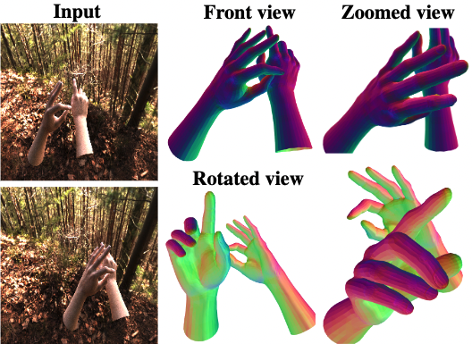

# Spectral Graphormer: Spectral Graph-based Transformer for Egocentric Two-Hand Reconstruction using Multi-View Color Images

Tensorflow implementation of the paper ["Spectral Graphormer: Spectral Graph-based Transformer for Egocentric Two-Hand Reconstruction using Multi-View Color Images"](), ICCV 2023.

[[Project page]]() [[arXiv]]() [[Data]]() (coming soon)

<p align="center">

</p>

## Introduction
We propose a novel transformer-based framework that
reconstructs two high fidelity hands from multi-view RGB
images. As existing datasets are either infeasible for egocentric viewpoints or lack background variations, we create a large-scale synthetic dataset with diverse scenarios and collect a real dataset from multi-calibrated camera setup to verify our proposed multi-view image feature fusion strategy. To make the reconstruction physically plausible, we propose two
strategies: (i) a coarse-to-fine spectral graph convolution
decoder to smoothen the meshes during upsampling and (ii)
an optimisation-based refinement stage at inference to prevent self-penetrations.

## Citation

If you find this code useful in your research, please consider citing:

```bibtex
@inproceedings{placeholder,
author = {placeholder},
title = {Spectral Graphormer: Spectral Graph-based Transformer for Egocentric Two-Hand Reconstruction using Multi-View Color Images},
booktitle = {ICCV},
year = {2023}
}
```
