Additional data and diagrams for paper [Streaming Parrotron for on-device speech-to-speech conversion](https://arxiv.org/abs/2210.13761)

# Input audio and output audio files generated by best streaming model *LSA_LS2* and by *Base* non streaming model:

VCTK data [license](https://datashare.ed.ac.uk/bitstream/handle/10283/3443/license_text?sequence=3&isAllowed=y)
|  Audio files      | Description  |
| ---------------- | --------------------- |
|[Input](vctk/input) | Input data containing clean audio clips from VCTK data.     |
|[nEnc_nDec_nGL](vctk/nEnc_nDec_nGL) | *Base* model with non streaming encoder, non streaming decoder and non streaming Griffin Lim.  |
|[LSA LS2(int8),sDec(int8)+GL](vctk/stR764CR44_int8_sDec_int8_sGL1) | Model with quantized int8 streaming encoder LSA_LS2, quantized int8 streaming decoder and streaming vocoder Griffin Lim sGL1 (in this paper, it corresponds to audio examples Table 5: LSA LS2 int8, sDec int8 with GL).  |
|[LSA_LS2(int8)+sDec(int8)+MG](vctk/stR764CR44_int8_sDec_int8_sMelGan1) | Model with quantized int8 streaming encoder LSA_LS2, quantized int8 streaming decoder and streaming neural vocoder sMelGan1 (in this paper, it corresponds to audio examples from Table 5: LSA LS2 int8, sDec int8 with MG).  |

We preserved audio clip names from VCTK dataset.

# Supplementary model diagrams for [full report](2210.13761.pdf):
All below models and blocks are described in our paper with text. Here we provide additional visual diagrams.

## *Base* non streaming parrotron model (section 2.3 in our [paper](https://arxiv.org/pdf/2210.13761.pdf))

*Base* non streaming parrotron model from [paper](https://ieeexplore.ieee.org/document/9414644) is shown on Fig.1. By bold lines we highlighted blocks which we converted to streaming mode in our [paper](https://arxiv.org/pdf/2210.13761.pdf), so that we can run Parrotron in streaming mode.

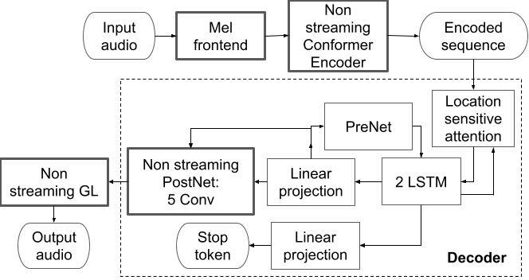 

Fig. 1 <em>Base</em> non streaming Parrotron model.

On Fig. 2 we show diagram of "Non streaming Conformer Encoder" of the *Base* model from [paper](https://ieeexplore.ieee.org/document/9414644)

 

Fig. 2 <em>Base</em> Non streaming Conformer Encoder.

The original Conformer block is described in [paper](https://arxiv.org/pdf/2005.08100.pdf). It has non streaming local self attention and causal convolution. Causal convolution is easy to stream, but non streaming conformer block computes local self attention over all frames of the input sequence, as shown on Fig. 3 (that is why it can not run in streaming mode).

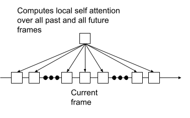 

Fig. 3 Non streaming local self attention uses all frames in the past and the future frames.

Diagram of "Causal Stack 2 frames and sub-sample by 2x" is shown on Fig. 4. It takes current frame concatenate it with frame on the left side, then project it (to the dimension of input frame) with fully connected layer and then subsample output frames by 2x in time dimension (it will reduce total computation in the next layers).

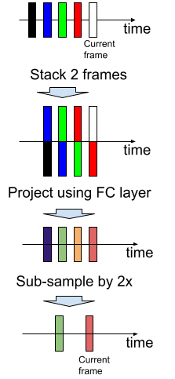 

Fig. 4 Diagram of "Causal Stack 2 frames and sub-sample by 2x".

## Streaming Parrotron model
Streaming Parrotron model is shown on Fig. 5

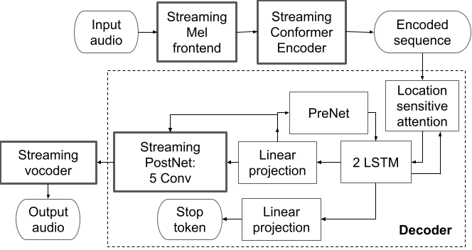 

Fig. 5 Streaming Parrotron model.

To run Parrotron model in streaming mode, we converted blocks (highlighted by bold line on Fig. 1) to streaming mode:

* Conversion of non streaming "Mel frontend" to "Streaming Mel frontend"(we made mel frontend causal) does not impact model accuracy.
* In our paper we showed that conversion of "Non streaming PostNet: 5 Conv" to "Streaming PostNet: 5 Conv"(we made all conv layer causal) does not impact model accuracy.
* In our [paper](https://arxiv.org/pdf/2203.00756.pdf) we showed that conversion of non streaming Griffin Lim vocoder to streaming vocoder (based on Griffin Lim or MelGAN) does not impact model accuracy.
* Conversion of "Non streaming Conformer Encoder" to "Streaming Conformer Encoder"(we made all layers causal) impacts accuracy a lot as shown in [paper](https://arxiv.org/pdf/2210.13761.pdf). It is the main focus of this research. In addition we proved that we can run our model with 2x real time factor on mobile phone CPU (and showed that quantization is important for achieving our goal).

### Streaming encoder *Causal* (section 2.5 in our [paper](https://arxiv.org/pdf/2210.13761.pdf))
On Fig. 6 we show diagram of *Causal* "Streaming Conformer Encoder" of Streaming Parrotron model from our [paper](https://arxiv.org/pdf/2210.13761.pdf). It is built using the following layers: Causal conformer blocks that have access to only
65 hidden-states form the left (i.e., left context of 65); Causal Stacker which stacks 2 frames project them back to original dimension of one frame and then and sub-sample them by 2x in time dimension.

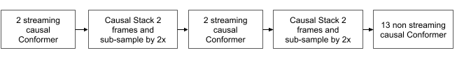 

Fig. 6 Causal streaming Conformer Encoder.

The main component of Conformer block is local self attention. Streaming causal local self attention, computes self attention only on the past frames, as shown on Fig. 7.

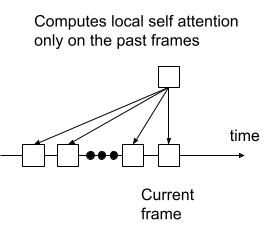 

Fig. 7 Streaming Causal local self attention diagram.

### Streaming encoder using look-aheads with streaming aware non-causal conformer block with self-attention looking at the left 65 hidden-states and a limited look ahead of the future/right (section 2.6 in our [paper](https://arxiv.org/pdf/2210.13761.pdf)).

*LSA1* streaming Conformer encoder is shown on Fig. 8. It is composed of sequence of: 2 causal conformer blocks, one stacker with subsampling, 2 causal conformer blocks, one stacker with subsampling, 3 causal conformer blocks, one non causal conformer block (with 5 frames lookahead R=5), 9 causal conformer blocks.

*LSA2* streaming Conformer encoder is shown on Fig. 9.

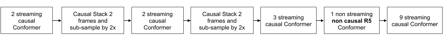 

Fig. 8 <em>LSA1</em> streaming Conformer Encoder.

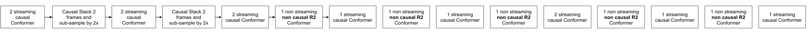 

Fig. 9 <em>LSA2</em> streaming Conformer Encoder.

The main component of streaming non causal conformer block is non causal local self attention. Streaming non causal local self attention computes self attention on 65 past frames and 5 frames in the future (R=5, also called right context), On Fig. 10 we show how streaming non causal local self attention is computed for a case when it looks into one future frame (R=1) and 65 frames in the past (it corresponds to layer name CBR1).

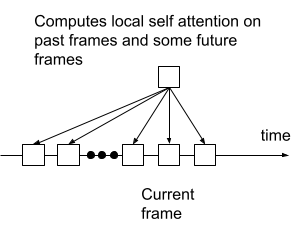 

Fig. 10 Streaming non causal local self attention diagram for CBR1 layer.

### Streaming encoder using look-aheads with streaming aware Stacker Layers with different number of look-aheads (section 2.6 in our [paper](https://arxiv.org/pdf/2210.13761.pdf)).

*LS1* streaming Conformer encoder is shown on Fig. 11. It is composed of sequence of: 2 causal conformer blocks, one non causal stacker (with R=3 frames lookahead) with subsampling, 3 causal conformer blocks, one non causal stacker (with R=4 frames lookahead) with subsampling, 12 causal conformer blocks.

*LS2* streaming Conformer encoder is shown on Fig. 12.

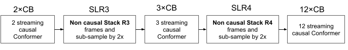 

Fig. 11 <em>LS1</em> streaming Conformer Encoder.

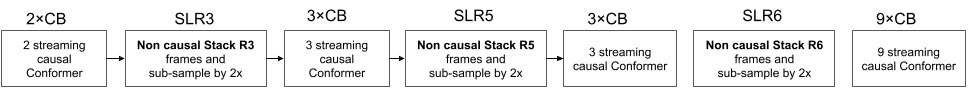 

Fig. 12 <em>LS2</em> streaming Conformer Encoder.

Diagram of streaming "Non causal Stack R2 frames and sub-sample by 2x" is shown on Fig. 13. It takes current frame concatenate it with 2 future frames (R=2), then project it (to the dimension of input frame) with fully connected layer and then subsample output frames by 2x in time dimension. As you can see in Fig. 13 this layer introduces delay equal R.

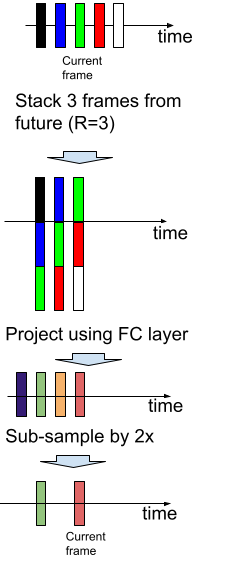 

Fig. 13 Diagram of "Non causal Stack R=2 frames and sub-sample by 2x".

### Streaming encoder using look-aheads by combining both types of look-aheads: self-attention look-ahead and look-ahead stacker (section 2.6 in our [paper](https://arxiv.org/pdf/2210.13761.pdf)).

*LSA_LS1* streaming Conformer encoder is shown on Fig. 14. It is composed of sequence of: 2 causal conformer blocks, one non causal stacker (with R=7 frames lookahead) with subsampling, 3 causal conformer blocks, one non causal stacker (with R=9 frames lookahead) with subsampling, 10 causal conformer blocks, one non causal conformer block (with 4 frames lookahead R=4), 1 causal conformer block.

*LSA_LS2* streaming Conformer encoder is shown on Fig. 15.

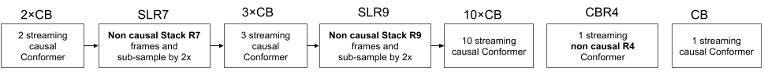 

Fig. 14 <em>LSA_LS1</em> streaming Conformer Encoder.

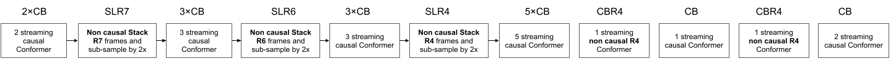 

Fig. 15 <em>LSA_LS2</em> streaming Conformer Encoder.

