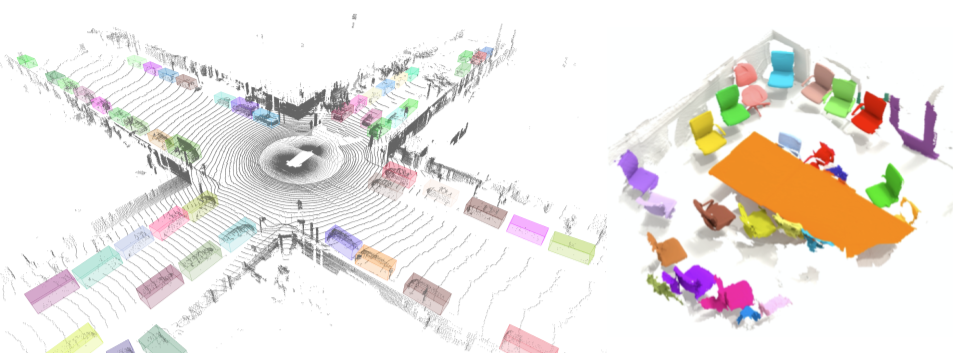

# TensorFlow 3D

Creating accurate machine learning models capable of localizing and identifying
multiple objects in a 3D scene and assigning semantic labels to the scene components is a core challenge in computer vision with applications in robotics and autonomous driving. The TensorFlow 3D codebase is an open source framework built on top of TensorFlow 2 and Keras that makes it easy to construct, train and deploy 3D Object Detection, 3D Semantic Segmentation and 3D Instance Segmentation models. At Google we’ve certainly found this codebase to be useful for our computer vision needs, and we hope that you will as well.

Contributions to the codebase are welcome and we would love to hear back from
you if you find this codebase useful. Finally if you use the TensorFlow 3D for a research publication, please consider citing:

* <a href='https://arxiv.org/abs/2004.01170' target='_blank'>DOPS: Learning to Detect 3D Objects and Predict their 3D Shapes</a>,
<em>Mahyar Najibi, Guangda Lai, Abhijit Kundu, Zhichao Lu, Vivek Rathod, Tom Funkhouser, Caroline Pantofaru, David Ross, Larry Davis, Alireza Fathi, CVPR 2020</em>

* <a href='https://arxiv.org/abs/2007.12392' target='_blank'>An LSTM Approach to Temporal 3D Object Detection in LiDAR Point Clouds</a>, <em>Rui Huang, Wanyue Zhang, Abhijit Kundu, Caroline Pantofaru, David A Ross, Thomas Funkhouser, Alireza Fathi, ECCV 2020</em>

# Release Notes

This release includes:

* GPU/CPU op for 3d submanifold sparse convolution.
* A configurable 3d sparse voxel unet network that is used as the feature extractor in our models.
* Training and evaluation code for 3D Semantic Segmentation, 3D Object Detection and 3D Instance Segmentation.
* Data and configuration for training and evaluation on Waymo Open Dataset, ScanNet Dataset, and Rio Dataset.

# Resources

* <a href='doc/setup.md' target='_blank'>Requirements, Installation and Usage</a>
* <a href='doc/tf3d_datasets.md' target='_blank'>Datasets</a>
* <a href='doc/models.md' target='_blank'>TensorFlow 3D Model</a>
* <a href='ops/README.md' target='_blank'>Preparing and Compiling the Sparse Conv Op</a>

# Maintainers

* <a href='https://sites.google.com/corp/view/ruihuang/home' target='_blank'>Rui Huang</a> (@GitHub HRLTY)
* <a href='https://www.alirezafathi.org/' target='_blank'>Alireza Fathi</a> (@GitHub afathi3)

# Acknowledgement

We thank Guangda Lai and Abhijit Kundu for their contributions to this code. We also like to thank Thomas Funkhouser, David Ross and Caroline Pantofaru for very insightful and helpful discussions throughout this project. Finally we thank Pei Sun for helping us with the Waymo Open dataset, Johanna Wald for her help with the Rio dataset and Angela Dai and Matthias Niessner for their help with the ScanNet dataset.

