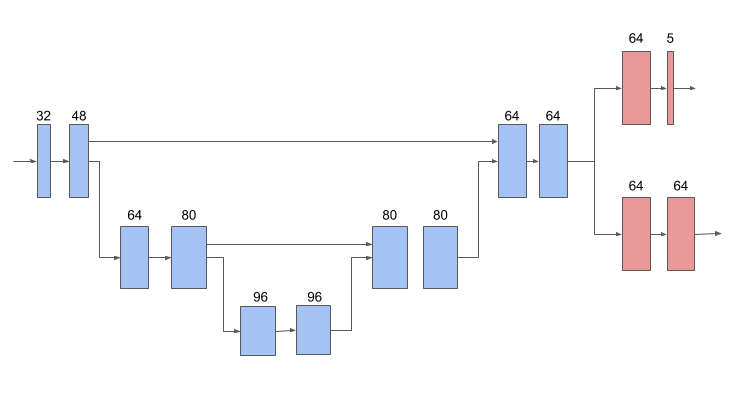

# Training and Evaluation of the Pipelines

TensorFlow 3D provides training and evaluation pipelines for 3d semantic
segmentation, 3d instance segmentation and 3d object deteciton.

## Train

For each task and dataset, there is a corresponding `gin` config file and `bash`
script. You can edit the `gin` config file if you are interested in configuring
the network or loss, and edit its `bash` script for filling in the dataset path,
configuring the optimization and training.

Please note that the configuration in `bash` script will override the `gin`
config file.

For example, use the following steps for training a semantic segmentation model 
on the Waymo Open Dataset:

```bash
# Edit the gin config file "tf3d/semantic_segmentation/configs/waymo_train.gin"
# Edit the script file "tf3d/semantic_segmentation/scripts/waymo/run_train_locally.sh"
# Run the train script (Optional: set ${CUDA_VISIBLE_DEVICES} before running)
bash tf3d/semantic_segmentation/scripts/waymo/run_train_locally.sh
```

The `${TRAIN_DIR}` (defined in the script) will contain a `train` folder with
Tensorboard `events` file, and a `model` folder with saved checkpoints.

## Evaluation

Similar to training, there is an eval `gin` config file, and a `bash` script for
for each task and dataset.

For example, the following steps are for evaluating semantic segmentation model
on Waymo Open Dataset:

```bash
# Edit the gin config file "tf3d/semantic_segmentation/configs/waymo_eval.gin"
# Edit the script file "tf3d/semantic_segmentation/scripts/waymo/run_eval_locally.sh"
# Run the evaluation script (Optional: set ${CUDA_VISIBLE_DEVICES} before running)
bash tf3d/semantic_segmentation/scripts/waymo/run_eval_locally.sh
```

The `${EVAL_DIR}` (defined in the script) will contain a
`eval_${EVAL_SPLIT}_mesh` folder and a `eval_${EVAL_SPLIT}` folder with
Tensorboard `events` file.

## Tensorboard

For monitoring the training progress and evaluation results, please start a
[Tensorboard](https://www.tensorflow.org/tensorboard) process:

```bash
tensorboard --logdir=${TRAIN_DIR or EVAL_DIR}
```

The training progress contains the loss values and learning rate.

The quantitative results include IoU (for semantic segmentation) or mAP (for
object detection) metrics. The qualitative results is in the `Mesh` tab of the
Tensorboard page, with the input point cloud, the ground truth and the
prediction.

# Tools and Utility Functions

We believe some of the users might be less interested in the pipelines and 
instead would be interested in using some of the utility functions or networks 
that comes with this codebase. Below we have provided some of these use cases:

## 3D Submanifold Sparse Convolution Block

The convolution block receives a set of sparse voxel indices and their features,
performs a series of 3d submanifold sparse convolutions on them, and returns the
computed voxel features.

```python
# voxel_features: A tf.float32 tensor of size [b, n, f] where b is batch size, n is the number of voxels and f is the feature size.
# voxel_indices: A tf.int32 tensor of size [b, n, 3].
# num_valid voxels: A tf.int32 tensor of size [b] containing number of valid voxels in each of the batch examples.
from tf3d.layers import sparse_voxel_net_utils

conv_block = sparse_voxel_net_utils.SparseConvBlock3D(
  num_convolution_channels_list=[32, 48, 64],
  apply_relu_to_last_conv=True)
convolved_features = conv_block(voxel_features, voxel_xyz_indices, num_valid_voxels)
```

## 3D Sparse Voxel U-Net

<p align="center"></p>

Below is the code snippet that would create a sparse voxel u-net network that is
shown above. Note that a horizontal arrow takes in the voxel features and
applies a submanifold sparse convolution to it. An arrow that is moving down
performs a submanifold sparse pooling. An arrow that is moving up will
gather back the pooled features, concatenate them with the features coming
from the horizontal arrow, and perform a submanifold sparse convolution on the
concatenated features.

```python
from tf3d.layers import sparse_voxel_unet

task_names_to_num_output_channels = {'semantics': 5, 'embedding': 64}
task_names_to_use_relu_last_conv = {'semantics': False, 'embedding': False}
task_names_to_use_batch_norm_in_last_layer = {'semantics': False, 'embedding': False}

unet = sparse_voxel_unet.SparseConvUNet(
  task_names_to_num_output_channels,
  task_names_to_use_relu_last_conv,
  task_names_to_use_batch_norm_in_last_layer,
  encoder_dimensions=((32, 48), (64, 80)),
  bottleneck_dimensions=(96, 96),
  decoder_dimensions=((80, 80), (64, 64)),
  network_pooling_segment_func=tf.math.unsorted_segment_max)
outputs = unet(voxel_features, voxel_xyz_indices, num_valid_voxels)
semantics = outputs['semantics']
embedding = outputs['embedding']
```

