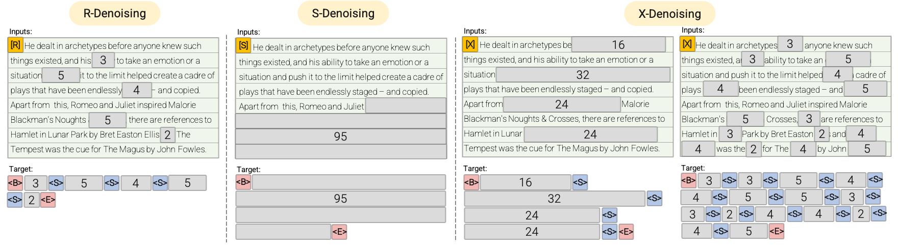

# UL2: Unifying Language Learning Paradigms

UL2 is a unified framework for pretraining models that are universally effective across datasets and setups.
UL2 uses Mixture-of-Denoisers (MoD), apre-training objective that combines diverse pre-training paradigms together. UL2 introduces a notion of mode switching, wherein downstream fine-tuning is associated with specific pre-training schemes.

Check out our Google AI blog post at [this link](https://ai.googleblog.com/2022/10/ul2-20b-open-source-unified-language.html)




## Checkpoints
The following table contains pretrained UL2 checkpoints.

**Update (28/2/2023): Flan-UL2 20B checkpoints are released.**

| Model           |    Size     | Step | Config  | Checkpoint  |
|:---------------:|:-----------:|:----:|:-------:|:-----------:|
| UL2    | 20B  | 1870000| [T5 configs](https://storage.googleapis.com/scenic-bucket/ul2/ul220b/config.gin)| `gs://scenic-bucket/ul2/ul220b/checkpoint_1870000` |
| UL2    | 20B  | 2050000| [T5 configs](https://storage.googleapis.com/scenic-bucket/ul2/ul220b/config.gin)| `gs://scenic-bucket/ul2/ul220b/checkpoint_2050000` |
| UL2    | 20B  | 2650000| [T5 configs](https://storage.googleapis.com/scenic-bucket/ul2/ul220b/config.gin)| `gs://scenic-bucket/ul2/ul220b/checkpoint_2650000` |
| Flan-UL2    | 20B  | 2283000| [T5 configs](https://storage.googleapis.com/scenic-bucket/ul2/ul220b/config.gin)| `gs://scenic-bucket/ul2/flan-ul220b-v3` |

## Reference

If you use UL2, please use the following BibTeX entry.

```
@article{tay2022unifying,
  title={Unifying Language Learning Paradigms},
  author={Yi Tay*, Mostafa Dehghani*, Vinh Q. Tran, Xavier Garcia, Dara Bahr, Tal Schuster, Huaixiu Steven Zheng, Neil Houlsby, and Donald Metzler},
  year={2022}
}
```

