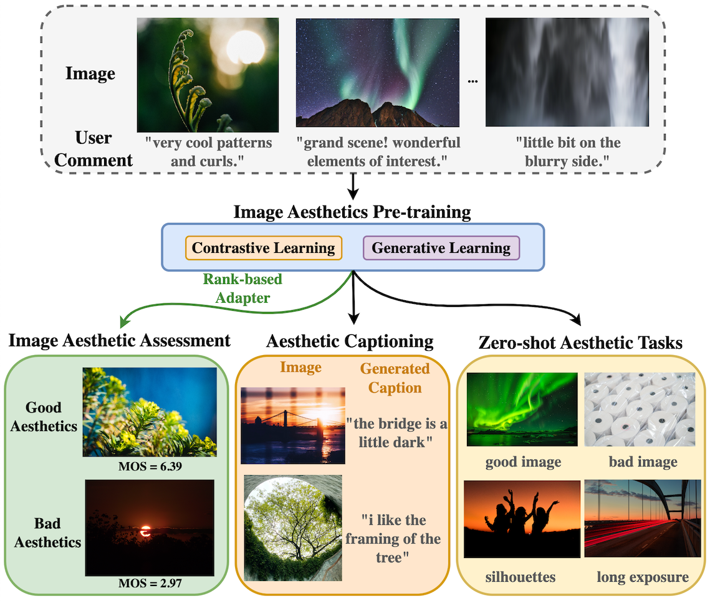

# VILA: Learning Image Aesthetics from User Comments with Vision-Language Pretraining

This directory contains the model and inference code for the CVPR 2023 paper:
["VILA: Learning Image Aesthetics from User Comments with Vision-Language
Pretraining"](https://openaccess.thecvf.com/content/CVPR2023/html/Ke_VILA_Learning_Image_Aesthetics_From_User_Comments_With_Vision-Language_Pretraining_CVPR_2023_paper.html)
by Junjie Ke, Keren Ye, Jiahui Yu, Yonghui Wu, Peyman Milanfar, and Feng Yang.



## TFHub

The VILA-R model is available on [TensorFlow Hub](https://tfhub.dev/s?q=vila)
for predicting image aesthetic score. See tfhub_inference.ipynb for a sample
notebook to try the model.

If you want to go deeper in the code and implementation, follow the instructions below.

## Prerequisite

Install dependencies (works with python3.10):

```
pip3 install -r requirements.txt
```

The model checkpoints can be downloaded from 
[gcloud directory link](https://console.cloud.google.com/storage/browser/gresearch/vila)

The folder contains the following checkpoints:

-   **./vila/checkpoints/vila_pretrain/**: VILA-P, pretrained on AVA-Captions
    dataset.
-   **./vila/checkpoints/vila_rank_tuned/**: VILA-R, finetuned on AVA MOS
    prediction task using the proposed rank-based adapter module.
-   **./vila/checkpoints/laion_pretrain/**: LAION pretrained CoCa model.
-   **./vila/spm_model/**: The sentence piece tokenizer used in the models.

## Run Inference

Example command for running VILA-R model for aesthetic assessment.

```shell
python3 -m vila.run_vila_predict \
  --ckpt_dir=/tmp/vila/checkpoints/vila_rank_tuned/ \
  --image_path=/tmp/image.jpg \
  --spm_model_path=/tmp/vila/spm_model/spm.model
```

Example command for running VILA model for captioning.

```shell
python3 -m vila.run_vila_decode \
  --ckpt_dir=/tmp/vila/checkpoints/vila_rank_tuned/ \
  --image_path=/tmp/image.jpg \
  --spm_model_path=/tmp/vila/spm_model/spm.model
```

Example command for running LAION pretrained model for captioning.

```shell
python3 -m vila.run_vila_decode \
  --is_pretrain \
  --ckpt_dir=/tmp/vila/checkpoints/laion_pretrain/ \
  --image_path=/tmp/image.jpg \
  --spm_model_path=/tmp/vila/spm_model/spm.model
```

## Citation

If you find this code useful for your publication, please cite the original
paper:

```
@inproceedings{ke2023vila,
  title = {VILA: Learning Image Aesthetics from User Comments with Vision-Language Pretraining},
  author={Ke, Junjie and Ye, Keren and Yu, Jiahui and Wu, Yonghui and Milanfar, Peyman and Yang, Feng},
  booktitle={Proceedings of the IEEE/CVF Conference on Computer Vision and Pattern Recognition},
  pages={10041--10051},
  year={2023}
}
```
