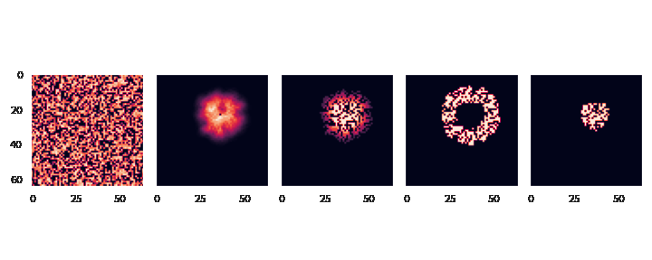

# VAEs for Percolation Models

[TOC]

## Summary

In this project, we explore applications of deep learning machinery to
percolation models of wildfire propagation.
This code was developed as a part of 2022 internship by Avik Pal.

## Wildfire Simulator



Wildfire Spreading in a `64x64` patch of land. The columns from left to right
are `Vegetation Density`, `Heat Content`, `Duration since fire started`,
`Land Patches currently burning`, and `Area already burnt`.

Wildfire Simulator written in JAX based on
[Wildfire-TPU](https://github.com/IhmeGroup/Wildfire-TPU).

## Dataset

To generate the dataset run the following with `datasets.py` imported:

```python
import tensorflow_datasets as tfds

ds_builder = tfds.builder('wildfire_dataset/<configuration>',
                          data_dir='<path/to/store/data>')
ds_builder.download_and_prepare()
ds_builder.as_dataset()
```

Currently only 2 configurations are implemented: `wind_fixed_ts` &
`realistic_fixed_ts`.

### Using a tool

Dataset generation can also be accomplished by running a dataset generation
tool as follows (example):
```bash
python -m wildfire_perc_sim.tools.dataset_generator \
  --dataset="wildfire_dataset/wind_fixed_ts" --data_path='/tmp/data'
```

## Experiments

### Deterministic Black Box Models

Deterministic Black Box Models contain 2 components:

  1. Backward Model: Takes a sequence of observations and predicts a hidden
  state that would generate this sequence of observations.
  2. Black Box Propagator: Iteratively applies a neural network on the hidden
  state to generate the next hidden state and emitted observation.

```bash
python -m wildfire_perc_sim.experiments.deterministic_black_box --\
  --cfg.data.name='wildfire_dataset/wind_fixed_ts' \
  --cfg.data.train_batch_size=1024 \
  --cfg.data.eval_batch_size=256 \
  --cfg.data.data_dir='/tmp/data' \
  --cfg.loss.weight_hidden_state=0.05 \
  --cfg.learning_rate=0.003
```

### Probabilistic Black Box Models

Probabilistic Black Box Models contain 2 components:

  1. Backward Model: Takes a sequence of observations and conditionally
  generated a hidden state that would generate this sequence of observations.
  Running with different `prng` will lead to generating different hidden states.
  2. Black Box Propagator: Iteratively applies a neural network on the hidden
  state to generate the next hidden state and emitted observation.

```bash
python -m wildfire_perc_sim.experiments.probabilistic_black_box --\
  --cfg.data.name='wildfire_dataset/wind_fixed_ts' \
  --cfg.data.train_batch_size=1024 \
  --cfg.data.eval_batch_size=256 \
  --cfg.data.data_dir='/tmp/data' \
  --cfg.loss.weight_hidden_state=0.05 \
  --cfg.loss.weight_kl_divergence=0.0001 \
  --cfg.learning_rate=0.003
```
